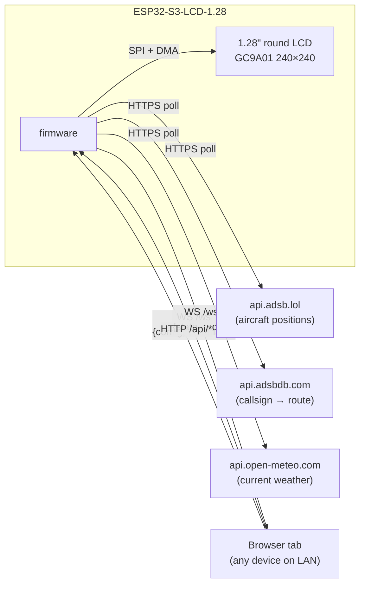
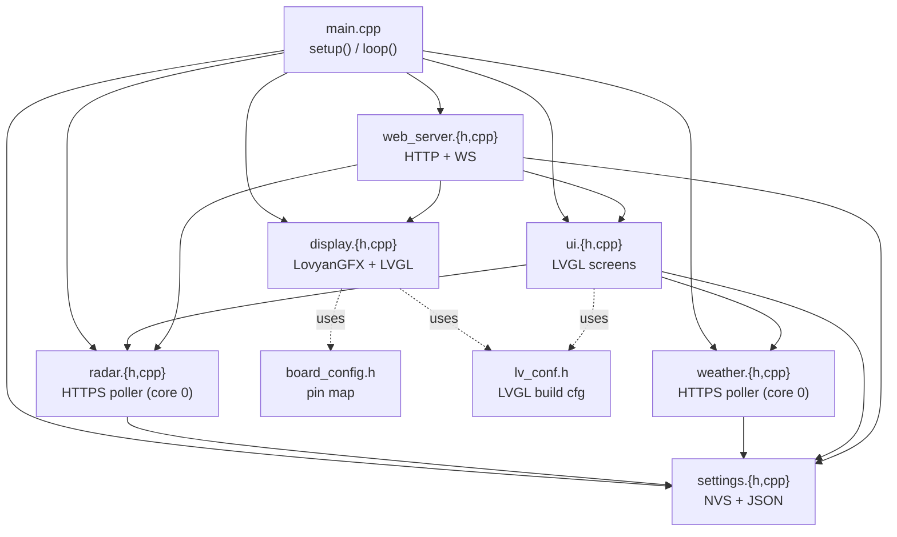
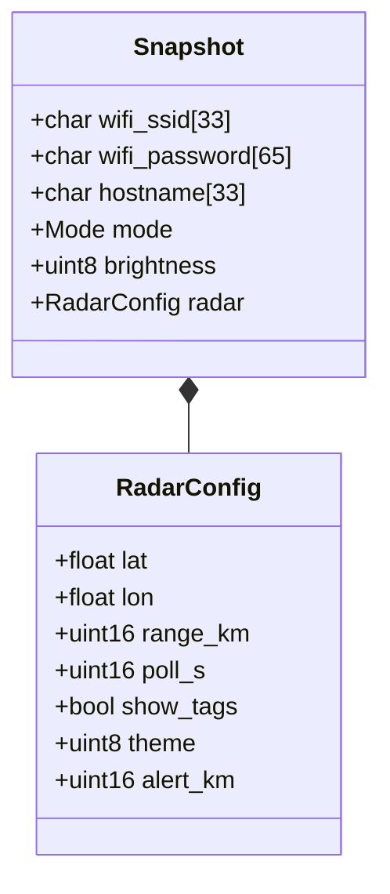
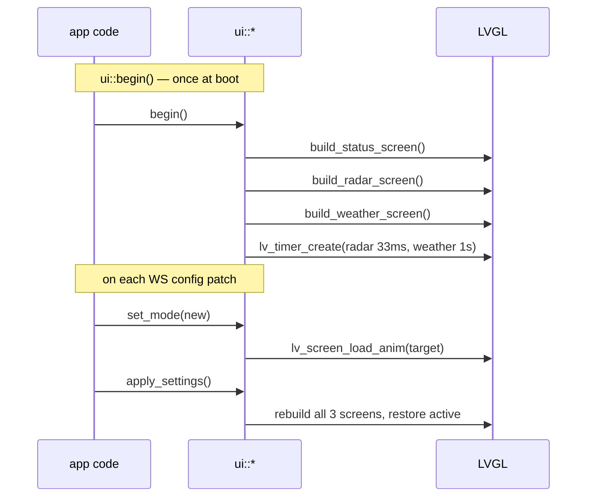
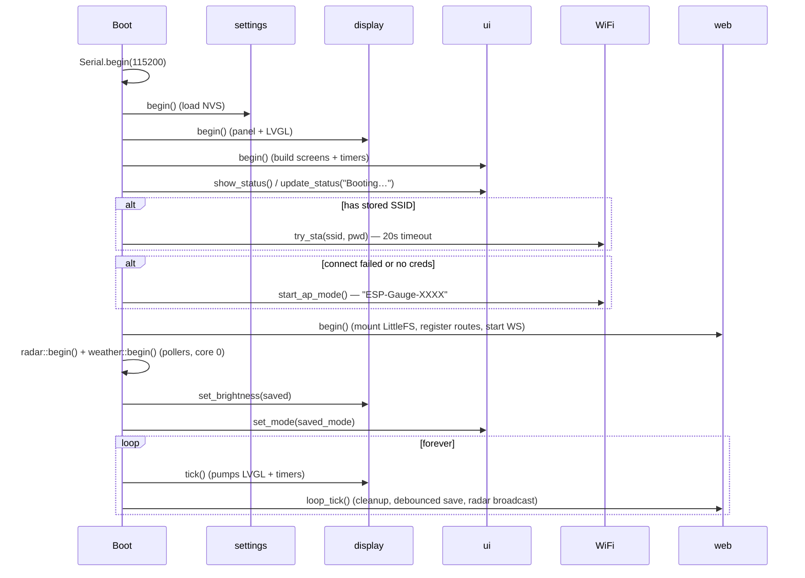
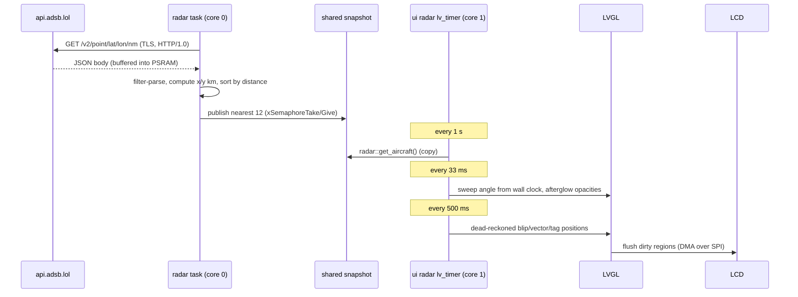
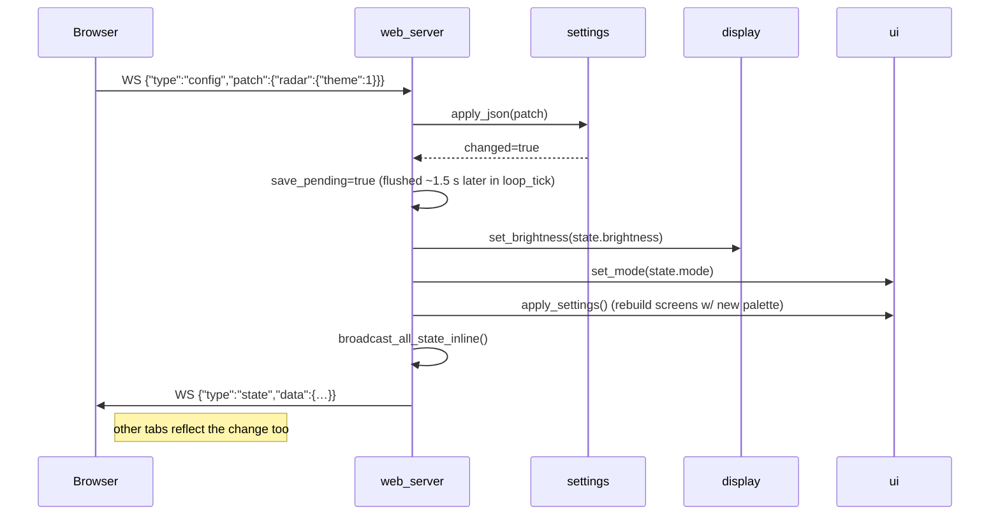

# Architecture & Code Walkthrough

This document explains how the ESP32-S3 Sky Gauge (flight radar + weather
display) is put together — the moving parts, how they talk, and where to look
when you want to change something.

> **History:** the project began as an audio VU meter fed by a PC microphone.
> Those modes were removed; `python_sender/` and `esp32_gauge/` are legacy.
> Some sequence diagrams below predate the change — module names and flows for
> radar/weather are accurate, audio-era traces have been removed.

If you've just cloned the repo, read sections **1–4** end-to-end. Sections 5
onward are reference material for when you're extending the system.

---

## 1. System overview

The device is fully self-contained — it fetches its own data over HTTPS:



The **firmware** is the only authoritative state. The web UI is a stateless
client that sends config patches and receives broadcasts.

### Responsibilities

| Piece | What it does | What it doesn't do |
|---|---|---|
| **firmware** (ESP32) | Renders the screen, owns all settings, serves the web UI, polls flight/weather APIs, broadcasts state + radar data | Store anything in the cloud |
| **web UI** (browser) | Mirror the radar scope, edit settings, switch modes | Fetch flight/weather data itself |

---

## 2. Repository layout

```
esp-lcd-project/
├── README.md                          User-facing setup & flashing guide
├── ARCHITECTURE.md                    ← you are here
│
├── firmware/                          PlatformIO project for the ESP32-S3
│   ├── platformio.ini                 Build flags, board, partition table, lib_deps
│   ├── src/
│   │   ├── main.cpp                   setup() / loop() — orchestrator
│   │   ├── board_config.h             Pin map (single source of truth)
│   │   ├── lv_conf.h                  LVGL 9 build-time configuration
│   │   ├── display.{h,cpp}            LovyanGFX panel + LVGL flush callback
│   │   ├── settings.{h,cpp}           NVS-backed config + JSON in/out
│   │   ├── ui.{h,cpp}                 LVGL screens (radar scope, weather, boot status)
│   │   ├── radar.{h,cpp}              poller for Radar mode (adsb.lol + adsbdb)
│   │   ├── weather.{h,cpp}            poller for Weather mode (buienradar, Open-Meteo fallback)
│   │   ├── net_fetch.{h,cpp}          shared HTTPS fetcher (TLS lock + PSRAM buffer + JSON filter)
│   │   ├── net_lock.h                 mutex: max one TLS connection at a time
│   │   └── web_server.{h,cpp}         AsyncWebServer routes + WebSocket
│   └── data/                          Uploaded to LittleFS as the web UI
│       ├── index.html
│       ├── style.css
│       └── app.js
│
├── python_sender/                     (legacy audio-era mic sender — unused)
└── esp32_gauge/                       (legacy UDP prototype — kept for reference)
```

---

## 3. Firmware module map



Each `.cpp` lives in its own anonymous namespace (`namespace { ... }`) for
internal state, with a small public surface in the `.h`. Nothing reaches across
modules except through those headers.

### 3.1 `board_config.h` — pin map

The only place hardware pins are written down. If your board revision needs
different pins, you change this file and nothing else. Encodes the official
Waveshare ESP32-S3-LCD-1.28 pinout (verified on hardware):

```
LCD_SCLK=10  LCD_MOSI=11  LCD_DC=8  LCD_CS=9  LCD_RST=12  LCD_BL=40
IMU_SDA=6    IMU_SCL=7    IMU_INT1=4 IMU_INT2=3
BAT_ADC=1
```

> A community "corrected" pinout (`RST=14, BL=2`) circulates online for a
> *different* board revision — using it here leaves the screen pure black
> (backlight pin wrong). `RST=12, BL=40` is correct for the unit this repo
> was built and tested against.

LVGL constants (`LCD_WIDTH=240`, `LCD_HEIGHT=240`, `LCD_SPI_FREQ_HZ=40 MHz`) also live here.

### 3.2 `display.{h,cpp}` — pixel pipeline

Two responsibilities:

1. **Initialize the GC9A01 panel** via a custom LovyanGFX class
   (`LGFX_GC9A01`) — SPI bus, panel parameters, PWM backlight.
2. **Wire LVGL to the panel** — create the `lv_display_t`, register a flush
   callback, hand it two partial draw buffers (24 lines × 240 px ×
   2 bytes ≈ 11.5 KB each, both in DRAM).

#### Flush callback (the hot path)

LVGL renders a rectangle into `px_map` and calls our callback. We byte-swap
RGB565 (LVGL is little-endian, GC9A01 expects big-endian) and push the bytes
over SPI:

```cpp
static void flush_cb(lv_display_t* d, const lv_area_t* area, uint8_t* px_map) {
    uint32_t w = area->x2 - area->x1 + 1;
    uint32_t h = area->y2 - area->y1 + 1;
    lv_draw_sw_rgb565_swap(px_map, w * h);
    tft.startWrite();
    tft.setAddrWindow(area->x1, area->y1, w, h);
    tft.writePixels((uint16_t*)px_map, w * h);
    tft.endWrite();
    lv_display_flush_ready(d);
}
```

Synchronous writes are used today. At 40 MHz SPI a full screen refreshes in
~25 ms, which is plenty for a VU meter. DMA would buy us ~2× headroom — easy
to add later by swapping `writePixels` for `pushImageDMA` and signalling
`flush_ready` from the DMA completion callback.

#### Public API

```cpp
display::begin();             // call once, before anything else LVGL-related
display::tick();              // call frequently from loop() — pumps LVGL
display::set_brightness(0..255);
```

### 3.3 `settings.{h,cpp}` — persistent state

`Snapshot` is a plain struct that holds everything the user can configure:
WiFi creds, mode, brightness, and the radar config (location + scope options —
the location is shared with Weather mode).



#### Why a single snapshot

Other code never reads NVS directly — they call `settings::state()` and get a
reference. Mutating it doesn't persist anything; you call `settings::save()`
when you're ready to flush. This makes the JSON-patch flow (apply many keys,
save once) trivial.

#### JSON shape

`settings::to_json(JsonObject, include_secrets)` writes the snapshot into a
JsonObject. The shape mirrors the struct nesting:

```json
{
  "mode": 0,
  "brightness": 200,
  "radar": { "lat": 52.3105, "lon": 4.7683, "range_km": 10, "poll_s": 10,
             "show_tags": true, "theme": 1, "alert_km": 3 },
  "wifi": { "ssid": "MyNet", "password": "********", "hostname": "esp-gauge" }
}
```

`apply_json(JsonVariantConst)` accepts the same shape (or a sparse patch) and
mutates the snapshot. It returns `true` only if something actually changed —
the caller uses that to decide whether to call `save()` + re-render.

### 3.4 `ui.{h,cpp}` — LVGL widget trees

Three screens: one per mode, plus an internal boot/status screen (shown during
startup so WiFi messages are readable; not user-selectable):

| Screen | Widgets |
|---|---|
| `Radar`   | range rings (round-distance steps + rim) + crosshair + cardinal ticks/"N" + 21× `lv_line` sweep (bright edge + fading trail) + center hub + 12× blip pools (`lv_obj` dot, `lv_line` heading vector, `lv_label` tag) + labels (track count, range marks, focus readout ×2, status) |
| `Weather` | 7 icon groups built from LVGL primitives (sun/partly/cloud/rain/snow/thunder/fog — circles + lines, no image assets) + labels (temp 48 pt, description, feels/humidity, wind) + status |
| status    | 3× `lv_label` (title, line1, line2) — boot messages only |

All screens are built once during `ui::begin()` (they're cheap), kept around as
`lv_obj_t*` globals, and switched between via `lv_screen_load_anim()`.

The radar screen is animated by an `lv_timer` (33 ms): the sweep angle is
derived from the wall clock (8 s/revolution — counting ticks turns timer
jitter into visible stutter), each blip's opacity flares as the sweep crosses
its bearing and decays back ("afterglow"), a fresh aircraft snapshot is pulled
from `radar::get_aircraft()` once a second, and the focused aircraft in the
bottom readout (callsign, route, altitude ft + climb/descend arrow, speed kt,
distance km) cycles every 4 s. Blip positions are **dead-reckoned** between
polls (last fetched position + ground-speed vector × data age, re-placed twice
a second) so aircraft glide instead of jumping every `poll_s`. Each blip
carries a speed-scaled heading vector; cardinal ticks + "N" mark true north
(up). A configurable overhead alert (`radar.alert_km`) pins focus to traffic
that close and pulses the outer ring; emergency squawks (7500/7600/7700) paint
the blip red; `radar.theme` switches the phosphor between green and amber.
The web UI mirrors the scope on a canvas, fed by the `radar` WS broadcast.

The weather screen updates from a 1 s `lv_timer`: it shows the icon group for
the current WMO weather code and refreshes the labels (a `set_text_if_changed`
helper skips identical updates so unchanged labels don't invalidate).



#### Scope geometry

Bearings come straight from lat/lon deltas (true north). On screen, 0° points
up and angles grow clockwise, so for a blip at distance `d` and bearing `b`:

```cpp
float r_px = d / range_km * RADAR_R;
x = CX + r_px * sinf(b);     // east  → right
y = CY - r_px * cosf(b);     // north → up (screen y grows down)
```

The sweep and its 20 trail lines are plain 2-point `lv_line`s recomputed each
tick; a round center hub (`lv_obj` with circle radius) covers their overlapping
flat ends at the origin.

### 3.5 `web_server.{h,cpp}` — HTTP + WebSocket

Two route surfaces:

| Path | Method | Purpose |
|---|---|---|
| `/`, `/style.css`, `/app.js` | GET | Static files from LittleFS |
| `/api/state` | GET / POST | Snapshot read / JSON patch |
| `/api/reboot` | POST | Restart |
| `/api/factory_reset` | POST | Wipe NVS + restart |
| `/ws` | WebSocket | Real-time config + state + radar broadcast |

The WebSocket is the primary control plane; the REST endpoints are an
escape hatch (e.g., for `curl` / scripting). Both apply patches via the same
`apply_config_patch()` helper.

#### loop_tick() housekeeping

`web::loop_tick()` (called from `main.cpp::loop()`) does three things:

- **Debounced NVS saves** — a brightness-slider drag arrives as dozens of
  config patches per second; settings apply live immediately, but the flash
  write happens once, ~1.5 s after the burst settles. Reboot paths call
  `flush_save()` first so nothing is lost. Brightness-only patches also skip
  the full screen rebuild (backlight PWM doesn't need one).
- **Radar broadcast** — in Radar mode, the aircraft list is serialized and
  pushed to all WS clients every 2 s (skipped when no client is connected).
- WS client cleanup.

### 3.6 `main.cpp` — orchestration



Boot intentionally lingers on the status screen for 2.5 s after WiFi is up so
you can read the IP before the screen switches to the saved mode.

### 3.7 `radar.{h,cpp}` — flight data poller

The only module that makes *outbound* network requests. A FreeRTOS task pinned
to **core 0** (the Arduino loop and LVGL run on core 1, so TLS handshakes never
stall rendering) polls two free public APIs while Radar mode is active:

| API | Call | Gives us |
|---|---|---|
| adsb.lol | `GET /v2/point/{lat}/{lon}/{radius_nm}` every `poll_s` seconds | live positions: callsign, lat/lon, baro altitude, ground speed |
| adsbdb.com | `GET /v0/callsign/{cs}` (max 2 per cycle) | route, e.g. `JFK>LHR` — cached in a 24-entry ring, unknowns cached too so they aren't retried |

Key implementation choices:

- **Fetches go through `net_fetch::http_get_json()`** (shared with weather):
  TLS connections are serialized via `net_lock.h` (the heap can't fit two
  handshakes), the body is buffered into a reused PSRAM buffer (cap 700 KB —
  a 100 km query near a hub returns a few hundred KB, and byte-by-byte stream
  parsing over TLS is slow enough that servers drop the connection mid-body),
  and the filtered `JsonDocument` uses a PSRAM allocator, keeping internal
  DRAM free. HTTP/1.0 (`useHTTP10`) avoids chunked transfer encoding;
  `setInsecure()` skips CA validation — public read-only data, not worth the RAM.
- The task computes distance/bearing from the configured home position
  (equirectangular approximation — fine below a few hundred km), keeps the
  nearest `MAX_AIRCRAFT` (12) sorted by distance, and publishes them under a
  mutex. The UI thread copies that snapshot via `radar::get_aircraft()`.
- When the mode isn't `Radar` (or lat/lon are unset, or WiFi is down) the task
  idles cheaply and reports a `Status` the UI renders ("SET LOCATION", etc.).

### 3.8 `weather.{h,cpp}` — current-conditions poller

Mirrors the radar module's pattern (mode-gated core-0 task, mutex-guarded
snapshot, `Status` enum for the UI). Polls every **10 minutes**, retries
failures after 20 s; stale data is kept and shown rather than blanked. Uses
the same `radar.lat/lon` location — deliberately one "home position".

Primary source is **buienradar.nl** (`data.buienradar.nl/2.0/feed/json`,
~36 KB): actual measurements from the KNMI station network, with authentic
Dutch condition text classified into an icon by keyword matching. The feed
stopped carrying station coordinates (all 0 as of 2026-06), so the nearest
station is found by matching `StationId` against a baked-in table of KNMI
positions (`StationId = 6000 + KNMI STN`). If no station is within 100 km
(device taken outside NL/BE), it falls back to **Open-Meteo** with a WMO
weather-code → icon mapping. Both fetched via `net_fetch.{h,cpp}` — the
shared TLS + PSRAM-buffered + filtered-JSON helper also used by the radar.

---

## 4. End-to-end traces

### 4.1 A radar poll reaches the screen



### 4.2 Web UI changes a setting



### 4.3 First boot (no WiFi creds)

```mermaid
flowchart TD
    Boot([Power on]) --> LoadNVS[settings::begin]
    LoadNVS --> NoSSID{stored SSID?}
    NoSSID -- no --> AP[start_ap_mode: ESP-Gauge-XXXX]
    NoSSID -- yes --> TrySTA[try_sta — 20s]
    TrySTA --> STAok{connected?}
    STAok -- yes --> mDNS[MDNS.begin&#40;hostname&#41;] --> NTP[configTime]
    STAok -- no --> AP
    AP --> WebUp[web::begin]
    NTP --> WebUp
    WebUp --> UserAction([User opens web UI,<br/>enters WiFi, clicks Reboot])
    UserAction --> Boot
```



---

## 5. WebSocket protocol reference

The protocol is intentionally tiny — five message types in total.

### Client → device

| `type` | Fields | Sender | Effect |
|---|---|---|---|
| `hello` | — | any | reply with full `state` snapshot |
| `config` | `patch` (sparse settings object) | web UI | apply + persist (debounced) + broadcast |
| `command` | `cmd` ∈ `"reboot"`, `"factory_reset"` | web UI | the obvious thing |

### Device → client

| `type` | Fields | Recipient | Trigger |
|---|---|---|---|
| `state` | `data` (full Snapshot, password redacted) | the client that sent `hello`, or all clients after a config change | hello / config |
| `radar` | `ac` (array of `{cs,rt,x,y,alt,gs,trk,vr,gnd,emg}`), `age` ms, `range` km | all clients, every 2 s | mode == Radar; lets the web UI render a live scope (positions are km east/north of home — clients dead-reckon with `gs`+`trk`) |

### Message examples

```json
// client → device
{ "type": "hello" }
{ "type": "config", "patch": { "mode": 1 } }
{ "type": "config", "patch": { "radar": { "range_km": 50, "theme": 1 } } }
{ "type": "command", "cmd": "reboot" }
```

```json
// device → client
{ "type": "state", "data": { "mode": 0, "brightness": 200, "radar": {…}, … } }
{ "type": "radar", "age": 4120, "range": 10, "ac": [ {…}, {…} ] }
```

---

## 6. Memory layout

| Region | Used by | Approx size |
|---|---|---|
| Flash (16 MB) | bootloader, partition table, app slot (6.5 MB), LittleFS (~5 MB), OTA slot, NVS | app slot at ~24% used |
| DRAM (320 KB) | Arduino runtime, WiFi stack, two LVGL draw buffers (2×19.2 KB), LVGL heap (96 KB), AsyncTCP buffers, poller task stacks (2×10 KB) | ~64% static |
| QSPI PSRAM (2 MB) | Radar mode: HTTP response buffer (≤700 KB, transient) + filtered JsonDocument | mostly free |

The two LVGL draw buffers are declared `DMA_ATTR` so they live in DRAM (DMA
can't access PSRAM on ESP32-S3 SPI). LVGL's heap (`LV_MEM_SIZE`) is 96 KB.

**The tight resource is internal DRAM heap.** Each TLS handshake (radar +
weather pollers) needs ~45 KB of free heap; when static usage crept past ~73 %
(60-line draw buffers), `start_ssl_client` began failing with -1 and the HTTP
server starved. If you grow buffers/pools, watch the serial log for TLS errors.

---

## 7. Extending the system

### 7.1 Add a new display mode

1. Add an enum value in `settings::Mode` (settings.h) and raise the bound
   checks in `settings::begin()` / `apply_json`.
2. In `ui.cpp`, add a `screen_X` global + `build_X_screen()` (+ an `lv_timer`
   if it animates — guard the callback on `current == Mode::X`).
3. Call `build_X_screen()` from `ui::begin()` **and** `ui::apply_settings()`,
   and add a case to `ui::set_mode()`.
4. In the web UI (`data/index.html`), add a `<button class="mode-btn" data-mode="N">…</button>` tile
   and (if it has settings) a card; register both in `MODE_CARDS` in `app.js`
   so the tab logic shows them.
5. If it needs external data, mirror `weather.{h,cpp}`: a mode-gated FreeRTOS
   task on core 0 + a mutex-guarded snapshot the UI copies from.
6. (Optional) add an `XConfig` struct in settings and wire it through
   `apply_json` / `to_json`.

### 7.2 Add a new settings field

1. Add the field to the right config struct in `settings.h`.
2. Add load/save lines in `settings::begin()` and `settings::save()` (NVS key
   must be ≤ 15 chars).
3. Add a `maybe_set<T>(patch["…"], …)` line in `settings::apply_json`.
4. Add an output line in `settings::to_json`.
5. Add an `<input>` + a wire-up call in `data/app.js`.

### 7.3 Use the IMU (QMI8658)

Pins are already in `board_config.h` (`IMU_SDA=6`, `IMU_SCL=7`, two
interrupts on GPIO 3/4). Add an I²C driver, wire it into `main.cpp::loop()`,
and expose tap/tilt events to `ui::*` for gestural mode switching.

---

## 8. Things you can ignore (but might wonder about)

- **`LGFX_USE_V1` build flag** — tells LovyanGFX to use its v1 API. The class
  hierarchy `lgfx::LGFX_Device` etc. lives in v1.
- **`LV_CONF_INCLUDE_SIMPLE`** — tells LVGL to `#include "lv_conf.h"` from the
  include path. `-I src` in build_flags makes it findable.
- **`-std=gnu++17`** + `build_unflags = -std=gnu++11` — Arduino-ESP32 still
  defaults to gnu++11. We force C++17 for `std::is_same_v`, structured
  bindings, `if constexpr`.
- **`board_build.arduino.memory_type = qio_qspi`** — QIO flash + QSPI (quad)
  PSRAM. Must match the actual module: the unit tested has 2 MB quad PSRAM, so
  `qio_qspi`. A genuine "R8" board with octal PSRAM would need `qio_opi`
  instead — a mismatch fails PSRAM init at boot ("wrong PSRAM line mode").
- **`ARDUINO_USB_CDC_ON_BOOT=0`** — routes `Serial` to UART0, which is what the
  board's CH343 USB-UART bridge is wired to. Set to `1` only if you flash and
  monitor through the ESP32-S3's *native* USB-C port instead.
- **`default_16MB.csv` partition table** — gives us a 6.5 MB app slot + ~5 MB
  LittleFS + OTA slot. The default 4 MB layout is too small once LVGL +
  WiFi + AsyncWebServer are in.

---

## 9. Where to break things first

If you're poking around to learn the codebase, in roughly this order:

1. `data/app.js` — change a label, see it appear in the browser. Re-upload with `pio run -t uploadfs` (no firmware reflash needed).
2. `ui.cpp` — change `SWEEP_PERIOD_MS` or a palette constant, reflash, watch the scope change.
3. `settings::Snapshot` defaults in `settings.h` — change the default `range_km` and factory-reset to see it apply.
4. `web_server::handle_ws_message` — add a new `type` to the WS protocol (e.g., `"ping"` that echoes `"pong"`) and call it from app.js.
5. Build an entirely new mode (section 7.1) — `weather.{h,cpp}` is the template.
