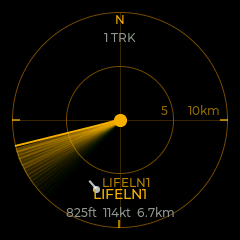
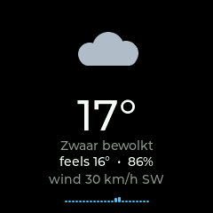
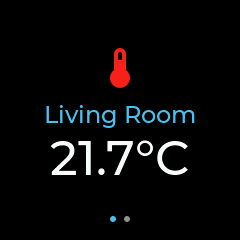
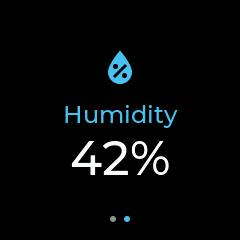

# ESP32-S3 Sky Gauge

A round-LCD desk gauge for the **Waveshare ESP32-S3-LCD-1.28** that shows a
live **flight radar** of aircraft around your home, the **current weather**, and
your **Home Assistant** entities — fully self-contained: the device fetches
everything itself over WiFi from free public APIs (and, optionally, your own HA
instance). It serves its own web UI for mode switching and configuration.

| Flight radar (amber theme) | Weather + rain nowcast | Home Assistant |
|:---:|:---:|:---:|
|  |  |  |

*Real screen captures (`/shot.bmp`): a busy evening scope — 12 contacts around
Schiphol, focused on a Ryanair overflight (Billund→Vienna, FL360); the weather
screen with a shower approaching on the 2-hour rain graph; a Home Assistant
entity page (one big card per entity, Material Design icon, value + unit straight
from HA — pages cycle automatically).*

```
                          Wi-Fi / HTTPS
        ┌──────────────┐ ───────────────▶  api.adsb.lol       (aircraft positions)
        │ ESP32-S3 LCD │ ───────────────▶  api.adsbdb.com     (callsign → route)
        │  + web UI    │ ───────────────▶  data.buienradar.nl (weather + rain nowcast)
        │              │ ───────────────▶  api.open-meteo.com (weather fallback)
        │              │ ───────────────▶  your Home Assistant (entity states)
        └──────┬───────┘
               │  WS / HTTP
               ▼
            browser (configuration UI + live radar mirror)
```


## Display modes

| Mode         | What it shows                                                         |
|--------------|-----------------------------------------------------------------------|
| Flight radar | Retro PPI scope (green or amber phosphor) of live aircraft around the configured location: rotating sweep with phosphor-decay trail, blips with afterglow + callsign tags + heading vectors, round-number range rings, true-north compass, cycling detail readout (flight, route, altitude ↑↓, speed, distance). Positions are dead-reckoned between polls so blips glide. Configurable overhead alert pulses the scope when traffic flies within N km; emergency squawks (7500/7600/7700) paint red. |
| Weather      | Actual measurements from the nearest buienradar.nl / KNMI weather station (Open-Meteo fallback outside NL/BE coverage): icon (drawn with LVGL primitives — sun/clouds/rain/snow/storm/fog), Dutch condition text, temperature, feels-like, humidity, wind speed + compass direction. Refreshes every 10 minutes. A 2-hour **rain nowcast** bar graph (buienradar raintext, 5-min steps, refreshed every 5 min) appears at the bottom whenever rain is coming. |
| Auto         | One or more resting screens (**Weather and/or Home Integration**, selected via checkboxes) shown between flyovers — if both are picked they alternate every 8 s. Switches to the radar scope while airborne traffic is within the auto-switch distance (own setting, default 5 km — independent of the overhead-alert pulse distance), and back 30 s after the sky clears. |
| Home Integration | Home Assistant entity pages — add as many as you need (up to 8) from HA's REST API (`/api/states` with a long-lived token), **one entity per page**, cycling every 4 s as big cards (icon, label, value) with centered page dots. The value's unit comes from the entity's own `unit_of_measurement`. Each page picks a **Material Design icon** (rendered from a generated LVGL MDI font): thermometer, humidity, power, battery, sun, home, gauge, fire, snowflake, bulb. |

| Home Integration — page 1 | page 2 (auto-cycling) |
|:---:|:---:|
|  |  |

Mode, location, radar range/theme/alert, brightness, hostname and WiFi
credentials are configurable from the web UI. The web UI shows only the cards
relevant to the selected mode (tab-style), and mirrors the radar scope live on
a canvas.

> For a guided tour of the codebase — module map, data flow, WebSocket
> protocol, and how to extend it — see [ARCHITECTURE.md](ARCHITECTURE.md).

---

## Repo layout

```
firmware/             PlatformIO project for the ESP32-S3 device
  platformio.ini
  src/                C++ sources (display, LVGL UI, radar/weather/HA pollers,
                      web server, settings)
  data/               static web UI (uploaded as a LittleFS image)
```

---

## 1. Build & flash the firmware

### Prerequisites
- [PlatformIO Core](https://platformio.org/install/cli) or the VS Code extension
- A USB-C cable to the dev board

> **Apple-silicon Macs:** PlatformIO's stock `tool-mklittlefs` package ships an
> x86-only binary — `uploadfs` fails with "Bad CPU type in executable". Fix:
> replace `~/.platformio/packages/tool-mklittlefs/mklittlefs` with the official
> `aarch64-apple-darwin` build from the
> [mklittlefs releases](https://github.com/earlephilhower/mklittlefs/releases).
> If the esptool bootloader step complains about `intelhex`, `pip install intelhex`
> into the Python environment PlatformIO uses.

### Build
```bash
cd firmware
pio run                       # compile
pio run -t upload             # flash the firmware (USB)
pio run -t uploadfs           # upload the web UI (LittleFS image from data/)

# Over WiFi (ArduinoOTA, port 3232) — no cable needed once deployed:
pio run -e ota -t upload      # firmware OTA (screen shows progress %)
pio run -e ota -t uploadfs    # web UI OTA
# macOS: if espota reports "No response from device", pass the IP:
pio run -e ota -t upload --upload-port <device-ip>
```

To read the serial log, `pio device monitor` works in an interactive terminal.
(It needs a TTY — in non-interactive shells, read the port with pyserial instead.)

> **Pin map:** the firmware uses the **official Waveshare pinout**
> (`LCD_BL=40, LCD_RST=12, LCD_DC=8, LCD_CS=9, LCD_SCK=10, LCD_MOSI=11`).
> A community "corrected" pinout (`BL=2, RST=14`) circulates for a *different*
> board revision — it leaves the screen dark on this one. If your board variant
> differs, edit `firmware/src/board_config.h` only — nothing else hard-codes pins.

> **USB:** this board connects through a CH343 UART bridge, so the firmware is
> built with `ARDUINO_USB_CDC_ON_BOOT=0` (routes `Serial` to UART0). If you flash
> via the ESP32-S3's native USB-C port instead, set that flag back to `1`.

### First boot
On a freshly flashed device with no stored WiFi credentials, the gauge starts
its own Access Point named `ESP-Gauge-XXXX` (XXXX = last 4 hex of the MAC).

1. Connect your laptop/phone to `ESP-Gauge-XXXX`.
2. Open <http://192.168.4.1>.
3. Enter your WiFi SSID + password under **Network**, click **Save & Reboot**.
4. After reboot, the device joins your WiFi. Its IP is shown on screen briefly,
   and the device is also reachable as `http://esp-gauge.local`.
5. Open the web UI, enter your latitude/longitude in the **Flight radar** card
   (tip: right-click your home in Google Maps to copy coordinates), click
   **Save radar settings**. Both modes use this location.

---

## 2. Web UI tour

The web UI is served straight from the device at `http://esp-gauge.local` (or
the IP shown on screen). Cards appear per selected mode:

- **Mode** — four tiles (Flight Radar / Weather / Auto / Home Integration); clicking switches
  the device *and* which settings cards are shown
- **Radar live** *(radar + auto modes)* — canvas mirror of the on-device scope,
  fed by a WebSocket broadcast, with its own sweep and dead-reckoned blips
- **Flight radar** *(radar + auto modes)* — latitude/longitude, range (km), poll
  interval, green/amber theme, overhead-alert distance, auto-switch distance,
  Auto resting screens (Weather/Home checkboxes), callsign tags; explicit **Save**
- **Weather** *(weather + auto modes)* — info card; the location comes from the
  Flight radar settings
- **Home Assistant** *(Home Integration mode)* — HA base URL, long-lived token
  (stored write-only, never sent back), poll interval, and a dynamic list of
  entity pages (label, icon glyph picker, entity) with **+ Add page** / **Remove**
  buttons (1–8 pages); explicit **Save** button
- **Display** — backlight brightness + a **Screenshot** button that captures
  exactly what's on the round LCD (LVGL snapshot → 24-bit BMP, served at
  `/shot.bmp`; scriptable: `curl -X POST http://<device>/api/shot && sleep 1 &&
  curl -o shot.bmp http://<device>/shot.bmp`) — always shown
- **Network** — SSID / password / hostname, with an explicit **Save & Reboot**
- **Danger zone** — reboot, factory reset (clears NVS)

---

## 3. WebSocket protocol

Endpoint: `ws://<device>/ws`

**Client → device**

```json
{ "type": "hello" }                                  // request initial state
{ "type": "config", "patch": { "mode": 1, "radar": { "range_km": 50 } } }
{ "type": "config", "patch": { "home": { "url": "http://homeassistant.local:8123",
    "token": "<long-lived-token>", "tiles": [ { "label": "Living",
    "icon": "thermometer", "entity": "sensor.living_temp" } ] } } }
{ "type": "command", "cmd": "reboot" }
{ "type": "command", "cmd": "factory_reset" }
```

**Device → client**

```json
{ "type": "state", "data": { /* full settings snapshot, password redacted */ } }
{ "type": "radar", "age": 4120, "range": 10,
  "ac": [ { "cs": "KLM1234", "rt": "AMS>LHR", "x": -2.1, "y": 5.4,
            "alt": 9000, "gs": 240, "trk": 265, "vr": -1200,
            "gnd": false, "emg": false } ] }          // every 2 s in radar mode
```

### REST fallback

| Method | Path                  | Purpose                                  |
|--------|-----------------------|------------------------------------------|
| GET    | `/api/state`          | current settings (JSON)                  |
| POST   | `/api/state`          | apply a JSON patch (same shape as `config.patch`) |
| POST   | `/api/shot`           | request a screen capture (taken on the LVGL thread ~ms later) |
| GET    | `/shot.bmp`           | most recent screen capture (240×240, 24-bit BMP) |
| POST   | `/api/reboot`         | reboot                                   |
| POST   | `/api/factory_reset`  | clear NVS and reboot                     |

---

## Data sources

| API | Used for | Cost / auth |
|---|---|---|
| [adsb.lol](https://api.adsb.lol/docs) | aircraft within radius (`/v2/point/lat/lon/nm`) | free, no key |
| [adsbdb.com](https://api.adsbdb.com) | callsign → origin/destination route | free, no key |
| [buienradar.nl](https://data.buienradar.nl/2.0/feed/json) | current weather — nearest KNMI station measurements (the feed no longer carries station coordinates, so KNMI positions are baked into `weather.cpp`) | free, no key |
| buienradar raintext (`gpsgadget.buienradar.nl/data/raintext`) | 2-hour precipitation nowcast, 5-min steps | free, no key |
| [open-meteo.com](https://open-meteo.com) | weather fallback outside NL/BE station coverage | free, no key |
| your Home Assistant | entity states (`/api/states/<entity>`) for Home mode | self-hosted; long-lived token |

Be a good citizen: the default poll intervals (10 s aircraft, 2 lookups/cycle
routes, 10 min weather, 15 s HA) are well within what these services expect.

---

## Troubleshooting

| Symptom | Likely cause |
|---|---|
| LCD completely black (no backlight) | Wrong `LCD_BL` pin — this board needs `BL=40`, not `2`. Check `board_config.h` |
| LCD backlit but static / garbled / wrong colors | Wrong `LCD_RST` / SPI pins — verify `board_config.h` against your board revision |
| Scope shows `SET LOCATION` | Latitude/longitude not saved yet — Flight radar card in the web UI |
| Scope shows `DATA ERROR` repeatedly | TLS handshake failing — usually low heap; check serial log for `start_ssl_client` errors |
| Web page loads but no styling / 404s | LittleFS not uploaded — run `pio run -t uploadfs` |
| `esp-gauge.local` unreachable | Windows + mDNS: install [Bonjour Print Services](https://support.apple.com/kb/DL999) or use the device IP directly |
| OTA upload: "No response from device" | espota's Python resolver hanging on `.local` (common on macOS) — pass `--upload-port <device-ip>` |
| Auto mode never switches to radar | Auto-switch distance set to 0, or no airborne traffic inside it — check the Flight radar card |
| Crash on boot, reboots in loop | PSRAM mismatch; verify `platformio.ini` `psram_type` matches your module |

---

## License

MIT — see [LICENSE](LICENSE). Not affiliated with adsb.lol, adsbdb, Buienradar,
KNMI or Open-Meteo; be considerate with poll rates toward these free services.

---

## Hardware reference

- Board: [Waveshare ESP32-S3-LCD-1.28](https://www.waveshare.com/esp32-s3-lcd-1.28.htm) — 16 MB quad flash + 2 MB embedded QSPI PSRAM (verified via `esptool flash_id`; Waveshare lists this board as "R8 / 8 MB OPI" but the unit tested reports 2 MB quad — if yours differs, adjust `psram_type` / `memory_type` in `platformio.ini`)
- Display: GC9A01 1.28" round IPS 240×240, SPI (DMA pixel pushes, 2×40-line LVGL buffers)
- IMU (unused for now): QMI8658 — wired in `board_config.h` for future gesture modes
